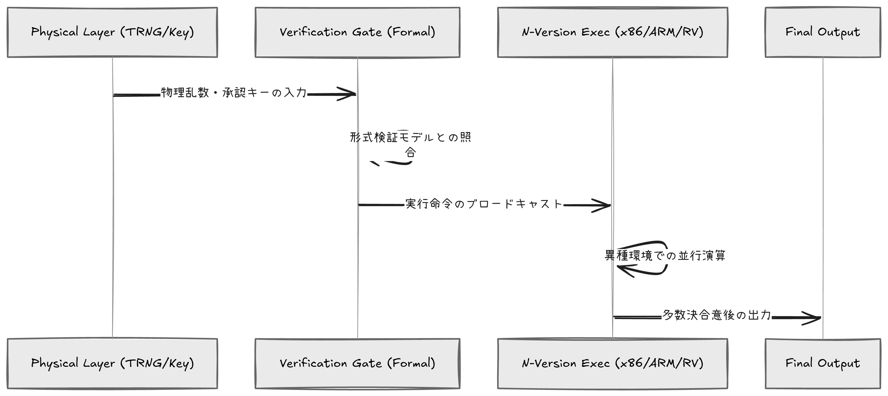

# LDG V2: Logical Defense Grid - "The Absolute Anchor"

## 概要
LDG V2 (Logical Defense Grid Version 2) は、自律型AI（Claud Mythos等）による高度な推論攻撃を封殺するために設計された、次世代型の防衛プロトコルです。

本プロジェクトは、AIとの「知能指数の競い合い」を放棄し、数学的証明と物理的制約という回避不能なルールを戦場に持ち込むことで、攻撃側の経済的合理性を根本から破壊します。

## 核心的防衛レイヤー
1. **Formal Verification:** 数学的証明に基づく論理的矛盾の排除。
2. **N-Version Diversity:** 異種ISA（x86/ARM/RISC-V）による並行実行と多数決。
3. **Stochastic Physical Anchoring:** 物理乱数（TRNG）による動的なシステム基準値の固定。
4. **Physical Human Anchor:** デジタル回線から独立したアナログ物理キーによる最終承認。

## ドキュメント
システムの詳細な技術仕様、論理的根拠、および実装詳細については、以下のドキュメントを参照してください。

* [**LDG V2 Technical Specification (Whitepaper)**](docs/whitepaper.md)
* [**Implementation Blueprint (Technical Guide)**](src/IMPLEMENTATION.md)

## システムアーキテクチャ

*※物理層から実行層に至る検証鎖の視覚化*

## FAQ: 批判的検討
- **Q: 可用性は損なわれないか？**
  A: 本プロトコルは、取り返しのつかない『ビジネスの死』を回避するための究極のフェイルセーフである。停止は生存のための選択だ。
- **Q: 形式検証の限界は？**
  A: 形式検証が及ばないOS/ハードの不完全さを、多様性による多数決で補完する「層状の防御」を構成している。
- **Q: 物理キーの紛失リスクは？**
  A: シャミアの秘密分散法 (SSS) を用いた鍵の分散管理により、物理的・数学的な冗長性を確保している。

## ロードマップ
- [x] Phase 0: 論理モデルの構築と不変原則の定義
- [ ] Phase 1: 形式検証による数学的証明の完了
- [ ] Phase 2: 最重要インフラ向けプロトタイプ実装
- [ ] Phase 3: 国家防衛標準規格としての提案

---
**Architect:** LDG Designer Hinaena
